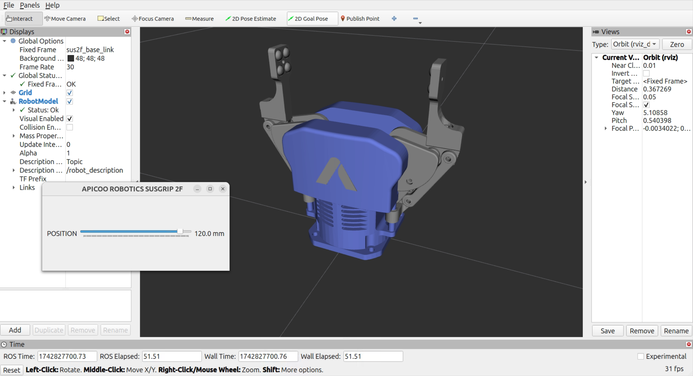

# SUSGRIP 2F Description (ROS2)

> Requires ROS2.

## 1. Overview

This repository contains the ROS 2 driver, controller and description packages for working with a [Smart 2-Finger Parallel Gripper](https://apicoorobotics.com/products-robotic-grippers/)
 developed by [Apioo Robotics](https://apicoorobotics.com/). 

<p align="center">
  
</p>

## 2. Build Status

<table width="100%">
  <tr>
    <th>ROS Distro</th>
    <th>ROS2 (24.04)</th>
  </tr>
  <tr>
   <th> Branch </th>
   <th>  Humble </th> 
  </tr>
</table>


## 3. Packages in the Repository:

  - `susgrip_description` - URDF, mesh file.

  - `susgrip_2f_driver` - SusGrip 2F Gripper ROS2 driver.

  - `susgrip_2f_control` - SusGrip 2F Gripper ROS2 controller.

## 4. Getting Started

1. **ROS2 Install** 

- Check this  [ROS 2 Humble installation site](https://docs.ros.org/en/humble/Installation.html).

- Quickly installation.

```bash
sudo apt install ros-humble-desktop
locale  # check for UTF-8
sudo apt update && sudo apt install locales
sudo locale-gen en_US en_US.UTF-8
sudo update-locale LC_ALL=en_US.UTF-8 LANG=en_US.UTF-8
export LANG=en_US.UTF-8
locale  # verify settings
sudo apt install software-properties-common
sudo add-apt-repository universe
sudo apt update && sudo apt install curl -y
sudo curl -sSL https://raw.githubusercontent.com/ros/rosdistro/master/ros.key -o /usr/share/keyrings/ros-archive-keyring.gpg
echo "deb [arch=$(dpkg --print-architecture) signed-by=/usr/share/keyrings/ros-archive-keyring.gpg] http://packages.ros.org/ros2/ubuntu $(. /etc/os-release && echo $UBUNTU_CODENAME) main" | sudo tee /etc/apt/sources.list.d/ros2.list > /dev/null
sudo apt update
sudo apt upgrade
sudo apt install ros-humble-desktop
sudo apt install ros-humble-rclcpp ros-humble-std-msgs ros-humble-sensor-msgs
sudo apt install python3-colcon-common-extensions
sudo apt install ros-humble-control-msgs
sudo apt install ros-humble-xacro
sudo apt install ros-humble-gazebo-ros-pkgs ros-humble-gazebo-ros2-control
sudo apt install python3-rosdep python3-rosdistro python3-rosinstall-generator python3-vcstool
sudo apt install python3-ament-package python3-ament-index-python python3-setuptools
```

🔌 Install CH340 Driver on Ubuntu

If your SusGrip 2F Gripper uses a USB-to-Serial adapter based on the CH340 chip, and your Ubuntu system does not automatically recognize the device (i.e., /dev/ttyUSBx does not appear), you may need to install the CH340 driver manually.

Based on this community: [CH340 driver install script](https://gist.github.com/dattasaurabh82/082d13fd61c0d06c7a358c5e605ce4fd).

2. **Create a new ROS2 workspace**:

```bash
git clone 
cd ..
source /opt/ros/humble/setup.bash
colcon build 
source install/setup.bash
```

## 5. How to connect SusGrip 2F Gripper

### 5.1.1 Visualizing SusGrip 2F in RViz

```bash
ros2 launch susgrip_description susgrip_2f_display.launch.py
```

<p float="center">
  <a href="https://apicoorobotics.com/">
    
  </a>
</p>

<!-- ### 5.1.2 Visualizing SusGrip 2F in Gazebo -->

## 5.2.Real Hardware Control

### 5.2.1. Launch Driver with USB Port

```bash
sudo chmod 777 /dev/ttyUSB0
```

```bash
ros2 launch susgrip_2f_driver sus_2f_bringup.launch.py port:=/dev/ttyUSB0
```

<p float="center">
  <a href="https://apicoorobotics.com/">
    
  </a>
</p>

### 5.2.2. Control via ROS 2 Topics

```bash
ros2 topic pub /susgrip_2f/dis std_msgs/msg/Float32 "data: 0.0"
ros2 topic pub /susgrip_2f/dis std_msgs/msg/Float32 "data: 50.0"
ros2 topic pub /susgrip_2f/dis std_msgs/msg/Float32 "data: 100.0"
```

### 5.2.3. Control via CLI Commands

```bash
ros2 run susgrip_2f_control with_cmd --m 60
```

```bash
ros2 run susgrip_2f_control with_cmd --m 10 --v 10
```

```bash
ros2 run susgrip_2f_control with_cmd --m 120 --v 100 --f 10
```

```bash
ros2 run susgrip_2f_control with_gui
```

## 6. Acknowledgments

Nghia N.K (nghia.nguyenkhac@apicoorobotics.com).

## 7. License

This model is released under an [BSD-2-Clause](LICENSE).

## 8. Reference link

SusGrip 2F Mujoco

SusGrip 2F Pybullet

SusGrip 2F Isaacsim
